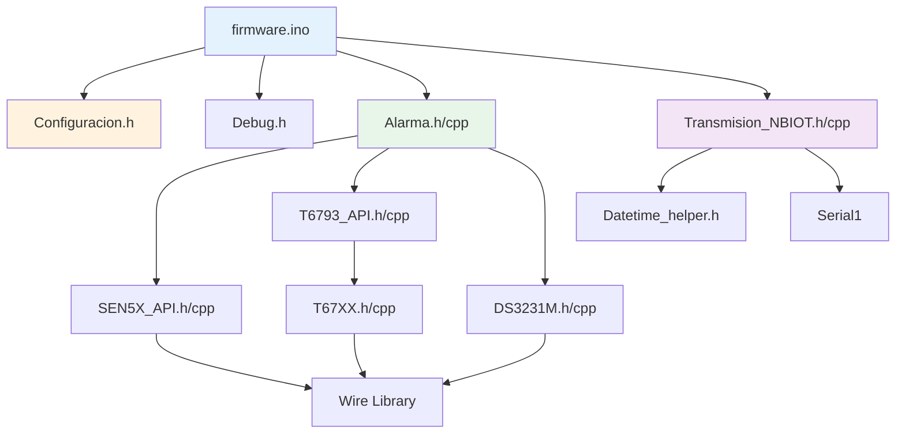
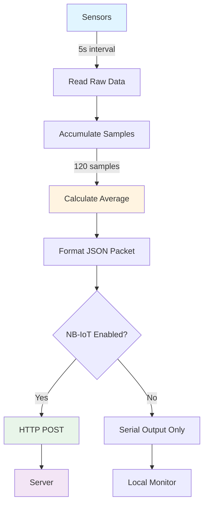

<!-- LICENSE INFORMATION
Copyright (C) 2025 ATARI Research Lab
Permission is granted to copy, distribute and/or modify this document
under the terms of the GNU Free Documentation License, Version 1.3
or any later version published by the Free Software Foundation;
with no Invariant Sections, no Front-Cover Texts, and no Back-Cover Texts.
A copy of the license is included in the section entitled "GNU
Free Documentation License".
-->

## Overview

The CICERONE AirLink firmware implements a non-blocking, timer-based architecture designed for
continuous indoor air quality monitoring with remote telemonitoring capabilities. Built on the
Arduino framework for the **Nano 33 BLE Sense Rev2**, it ensures reliable data collection and
transmission.

## Non-Blocking Timer System

The firmware uses a dual-timer architecture to achieve non-blocking operation:

### 5-Second Timer

**Implementation**: `millis()`-based

**Purpose**: Triggers sensor reading and data accumulation

**Characteristics**:

- Based on Arduino's `millis()` function for microsecond precision
- Non-blocking implementation prevents loop stalls
- Accuracy: ±10ms

**Code Example**:

```cpp
unsigned long current_millis = millis();
if (current_millis - prev_millis >= 5000) {
    prev_millis = current_millis;
    alarma_5s = true;  // Set flag for main loop
}
```

### 10-Minute Timer

**Implementation**: RTC-based

**Purpose**: Triggers data averaging and transmission

**Characteristics**:

- Uses DS3231M RTC for accurate timekeeping independent of microcontroller clock
- Maintains timing accuracy even during long-term deployment
- Accuracy: ±1 second

**Benefits**:

- Survives power cycles (RTC has battery backup)
- Independent of system clock drift
- Accurate over extended periods

## Modular Component Structure

The firmware is organized into logical modules, each with dedicated header and implementation files:

| Module | Files | Purpose | Dependencies |
|--------|-------|---------|--------------|
| **Main** | `firmware.ino` | Entry point, setup, and main loop | All modules |
| **Configuration** | `Configuracion.h` | Centralized settings (device ID, server, APN) | None |
| **Debug** | `Debug.h` | Multi-level logging macros | None |
| **Alarm System** | `Alarma.h/cpp` | Timer management and data averaging | Sensors, RTC |
| **SEN54 API** | `SEN5X_API.h/cpp` | Particulate matter & VOC sensor interface | Wire (I2C) |
| **T6793 API** | `T6793_API.h/cpp` | CO₂ sensor interface | T67XX driver |
| **T67XX Driver** | `T67XX.h/cpp` | Low-level I2C driver for T6793 | Wire (I2C) |
| **RTC** | `DS3231M.h/cpp` | Real-time clock interface | Wire (I2C) |
| **NB-IoT** | `Transmision_NBIOT.h/cpp` | Network communication module | Serial1 (UART) |
| **DateTime** | `Datetime_helper.h` | Date/time utilities and timezone support | None |

### Module Interaction Diagram



## Data Flow Pipeline

The firmware follows a structured data flow from sensor reading to transmission:



### Pipeline Stages

#### Stage 1: Sensor Reading (Every 5 seconds)

- Triggered by `alarma_5s` flag
- Reads all sensors via I2C
- Non-blocking implementation

#### Stage 2: Data Accumulation

- Sum values stored in accumulator variables
- Separate counters for different sensor groups
- Floating-point precision maintained

#### Stage 3: Averaging (Every 10 minutes)

- Arithmetic mean: `average = sum / count`
- Triggered by `alarma_10min` flag
- 120 samples (12 per minute × 10 minutes)

#### Stage 4: JSON Formatting

- Builds JSON object with all sensor data
- Includes timestamp from RTC
- Device ID from configuration

#### Stage 5: Transmission

- Conditional on `HABILITAR_NBIOT` setting
- HTTP POST to configured server
- Retry mechanism on failure

## Memory Management

The firmware employs careful memory management strategies to ensure reliable operation within the
constraints of the microcontroller.

### Static Allocation

**Approach**: Most variables are statically allocated

**Benefits**:

- Avoids heap fragmentation
- Predictable memory usage
- Faster execution (no malloc overhead)

**Example**:

```cpp
// Static allocation in Alarma.cpp
float sum_sen5x_mc_2p5 = 0.0f;
float avg_sen5x_mc_2p5 = 0.0f;
uint16_t cont1 = 0;
```

### Accumulator Variables

**Purpose**: Separate sum variables for each sensor parameter

**Structure**:

- `sum_*` - Accumulation variables (reset every 10 minutes)
- `avg_*` - Average variables (calculated every 10 minutes)
- `cont*` - Sample counters

**Memory Impact**: ~50 bytes per sensor parameter

### String Optimization

**Strategy**: Minimize dynamic string operations

**Techniques**:

- Use `F()` macro to store strings in flash memory
- Fixed-size character buffers for serial output
- Avoid String class concatenation in loops

**Example**:

```cpp
// Good: String in flash
Serial.println(F("Sensor initialized"));

// Avoid: Dynamic string allocation
String msg = "Value: " + String(value);  // Creates temporary objects
```

### Buffer Management

**Serial Communication**: 256-byte buffer for debug output

**NB-IoT Communication**: Fixed buffers for AT commands and responses

**JSON Generation**: Pre-allocated buffer (configurable size)

## Memory Usage Summary

| Category | Size | Notes |
|----------|------|-------|
| **Code (Flash)** | ~100-150 KB | Depends on enabled modules |
| **Global Variables** | ~5-10 KB | Sensor data, accumulators |
| **Stack** | ~2-4 KB | Function calls, local vars |
| **Debug Buffers** | ~256 bytes | When DEBUG_LEVEL > 0 |
| **Available Flash** | ~900 KB | Nano 33 BLE has 1MB flash |
| **Available RAM** | ~240 KB | Nano 33 BLE has 256KB RAM |

!!! success "Memory Efficiency"
    The firmware uses less than 15% of available flash and less than 10% of available RAM, leaving
    plenty of room for future enhancements.

## Conditional Compilation

The firmware uses preprocessor directives to include or exclude features at compile time.

### NB-IoT Module

```cpp
#if HABILITAR_NBIOT
    #include "Transmision_NBIOT.h"

    void loop() {
        if (alarma_10min) {
            nbiot_enviar(json);
        }
    }
#endif
```

**When disabled** (`HABILITAR_NBIOT = 0`):

- All NB-IoT code is removed from binary
- Reduces flash usage by ~30-40 KB
- Eliminates UART communication overhead
- Saves power (no cellular radio)

### Debug System

```cpp
#if DEBUG_LEVEL > 0
    #define DEBUG_ERROR(format, ...) debug_printf("[ERROR]", format, ##__VA_ARGS__)
#else
    #define DEBUG_ERROR(format, ...)  // Expands to nothing
#endif
```

**When disabled** (`DEBUG_LEVEL = 0`):

- All debug code removed (zero overhead)
- Reduces flash usage by ~10-15 KB
- Eliminates string storage in flash
- No serial output

## Benefits of Modular Architecture

### Code Maintainability

- **Separation of Concerns**: Each module has a single responsibility
- **Easy Testing**: Modules can be tested independently
- **Clear Interfaces**: Well-defined function signatures

### Extensibility

- **Add Sensors**: Create new API module following existing patterns
- **New Communication**: Replace NB-IoT with different protocol
- **Custom Processing**: Modify averaging algorithms without affecting sensors

### Debugging

- **Module-Level Debug**: Enable/disable debug per module
- **Isolated Issues**: Easier to identify problematic components
- **Clear Logging**: Debug messages tagged with module name

### Portability

- **Hardware Abstraction**: Sensor APIs abstract I2C details
- **Platform Independence**: Most code portable to other Arduino boards
- **Configuration Centralized**: Easy to adapt to different deployments

## Related Documentation

- [Program Flow](program-flow.md) - Detailed execution flow and state diagrams
- [Sensor Interfaces](sensor-interfaces.md) - Sensor communication protocols
- [Configuration System](../user-guide/firmware-configuration.md) - Device configuration
- [API Reference](api/files.md) - Complete code documentation
