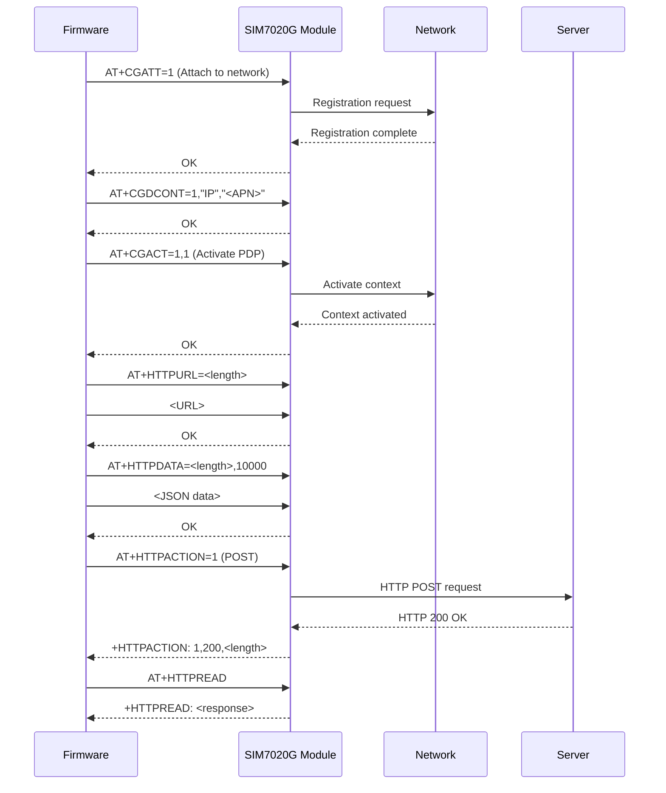
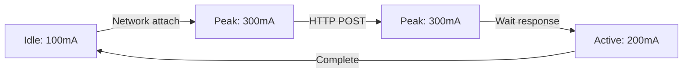

<!-- LICENSE INFORMATION
Copyright (C) 2025 ATARI Research Lab
Permission is granted to copy, distribute and/or modify this document
under the terms of the GNU Free Documentation License, Version 1.3
or any later version published by the Free Software Foundation;
with no Invariant Sections, no Front-Cover Texts, and no Back-Cover Texts.
A copy of the license is included in the section entitled "GNU
Free Documentation License".
-->

## Overview

The CICERONE AirLink device transmits averaged sensor data every 10 minutes via HTTP POST requests
over NB-IoT cellular connectivity. This page details the data format, network communication
protocol, and transmission process.

## JSON Packet Format

### Structure

Data is transmitted as a JSON object with the following structure:

```json
{
  "device_id": "AIRLINK_01",
  "timestamp": "2025-10-16T14:30:00+02:00",
  "pm1_0": 8.5,
  "pm2_5": 12.3,
  "pm4_0": 15.7,
  "pm10": 18.4,
  "voc_index": 156,
  "nox_index": 0,
  "temperature": 23.5,
  "humidity": 45.2,
  "co2": 687
}
```

### Field Descriptions

| Field | Type | Unit | Description |
|-------|------|------|-------------|
| `device_id` | string | - | Unique device identifier (from `ID_USUARIO`) |
| `timestamp` | string | ISO 8601 | Date/time with timezone offset |
| `pm1_0` | float | µg/m³ | Particulate matter 1.0 micron |
| `pm2_5` | float | µg/m³ | Particulate matter 2.5 micron |
| `pm4_0` | float | µg/m³ | Particulate matter 4.0 micron |
| `pm10` | float | µg/m³ | Particulate matter 10 micron |
| `voc_index` | integer | index | Volatile organic compounds index (1-500) |
| `nox_index` | integer | index | Nitrogen oxides index (typically 0 for SEN54) |
| `temperature` | float | °C | Ambient temperature |
| `humidity` | float | % | Relative humidity |
| `co2` | float | ppm | Carbon dioxide concentration |

### JSON Generation

```cpp
String nbiot_paquete() {
    StaticJsonDocument<512> doc;

    // Device identification
    doc["device_id"] = ID_USUARIO;

    // Timestamp (ISO 8601 with timezone)
    DateTime now = rtc.getRTCTime();
    char timestamp[30];
    snprintf(timestamp, sizeof(timestamp),
             "%04d-%02d-%02dT%02d:%02d:%02d+02:00",
             now.year(), now.month(), now.day(),
             now.hour(), now.minute(), now.second());
    doc["timestamp"] = timestamp;

    // SEN54 sensor data
    doc["pm1_0"] = avg_sen5x_mc_1p0;
    doc["pm2_5"] = avg_sen5x_mc_2p5;
    doc["pm4_0"] = avg_sen5x_mc_4p0;
    doc["pm10"] = avg_sen5x_mc_10p0;
    doc["voc_index"] = (int)avg_sen5x_voc_index;
    doc["nox_index"] = (int)avg_sen5x_nox_index;
    doc["temperature"] = avg_sen5x_temp;
    doc["humidity"] = avg_sen5x_hum;

    // T6793 sensor data
    doc["co2"] = avg_t6793_co2;

    // Serialize to string
    String json;
    serializeJson(doc, json);

    DEBUG_VERBOSE("JSON packet: %s", json.c_str());

    return json;
}
```

### Typical Packet Size

**Size**: 200-250 bytes (varies with floating-point precision)

**Compressed**: ~150-180 bytes (if compression used)

**Daily Data**: ~36 KB (250 bytes × 144 transmissions)

### Timestamp Format

**Standard**: ISO 8601

**Format**: `YYYY-MM-DDTHH:MM:SS±HH:MM`

**Example**: `2025-10-16T14:30:00+02:00`

**Components**:

- Date: `2025-10-16` (October 16, 2025)
- Time: `14:30:00` (2:30:00 PM)
- Timezone: `+02:00` (CEST, 2 hours ahead of UTC)

**Configuration**: Timezone offset defined in `Datetime_helper.h`

## NB-IoT Communication

### Module: SIM7020G

**Manufacturer**: SIMCom

**Technology**: NB-IoT (LTE Cat-NB1)

**Frequency Bands**: B1, B3, B5, B8, B20, B28

**Communication**: UART (Serial1 on Nano 33 BLE)

**Baud Rate**: 115200

**Power**: ~200-300 mA during transmission

### AT Command Protocol

The SIM7020G uses AT commands for configuration and data transmission:

#### Basic Commands

| Command | Purpose | Response |
|---------|---------|----------|
| `AT` | Test connectivity | `OK` |
| `AT+CGATT?` | Check network attachment | `+CGATT: 1` |
| `AT+CSQ` | Signal quality | `+CSQ: 25,99` |
| `AT+CPIN?` | Check SIM card | `+CPIN: READY` |

#### Network Configuration

```cpp
// Attach to network
sendATCommand("AT+CGATT=1");

// Configure APN
String apn_cmd = "AT+CGDCONT=1,\"IP\",\"" + String(APN_NBIOT) + "\"";
sendATCommand(apn_cmd);

// Activate PDP context
sendATCommand("AT+CGACT=1,1");

// Wait for network registration
sendATCommand("AT+CEREG?");
```

#### HTTP Configuration

```cpp
// Set HTTP URL
String url_cmd = "AT+HTTPURL=" + String(url.length());
sendATCommand(url_cmd);
sendATCommand(url);  // Send actual URL

// Set HTTP content type
sendATCommand("AT+HTTPCONTENT=\"application/json\"");

// Prepare to send data
String data_cmd = "AT+HTTPDATA=" + String(json.length()) + ",10000";
sendATCommand(data_cmd);
sendATCommand(json);  // Send JSON data

// Execute HTTP POST
sendATCommand("AT+HTTPACTION=1");  // 1 = POST

// Read response
sendATCommand("AT+HTTPREAD");
```

### Connection Sequence



### Error Handling

#### Connection Failures

```cpp
bool nbiot_enviar(String json) {
    int retry_count = 0;
    const int max_retries = 3;

    while (retry_count < max_retries) {
        if (nbiot_conectar()) {
            if (nbiot_post(json)) {
                DEBUG_INFO("Transmission successful");
                return true;
            }
        }

        retry_count++;
        DEBUG_WARN("Retry %d/%d", retry_count, max_retries);
        delay(5000);  // Wait before retry
    }

    DEBUG_ERROR("Transmission failed after %d retries", max_retries);
    return false;
}
```

#### Network Registration Issues

**Symptoms**: Module cannot attach to network

**Common Causes**:

- No SIM card or SIM not activated
- Weak signal strength
- Incorrect APN configuration
- Network coverage issue

**Debug Commands**:

```cpp
// Check SIM card
AT+CPIN?
// Expected: +CPIN: READY

// Check signal quality
AT+CSQ
// Expected: +CSQ: 15-31,99 (15-31 = good signal)

// Check network registration
AT+CEREG?
// Expected: +CEREG: 0,1 (registered, home network)
```

#### HTTP Errors

**Common HTTP Status Codes**:

| Code | Meaning | Action |
|------|---------|--------|
| 200 | OK | Success |
| 400 | Bad Request | Check JSON format |
| 401 | Unauthorized | Check API authentication |
| 404 | Not Found | Verify server URL/endpoint |
| 500 | Server Error | Server issue, retry later |
| 504 | Gateway Timeout | Network issue, retry |

**Handling in Code**:

```cpp
if (http_response == 200) {
    DEBUG_INFO("Data accepted by server");
} else if (http_response == 400) {
    DEBUG_ERROR("Invalid JSON format");
} else if (http_response >= 500) {
    DEBUG_ERROR("Server error, will retry");
} else {
    DEBUG_ERROR("HTTP error: %d", http_response);
}
```

## Power Consumption

### Transmission Power Profile

Typical power consumption during transmission cycle:



**Duration**: 30-60 seconds per transmission

**Energy**: ~50-100 mAh per transmission

**Daily**: ~7-14 Ah (144 transmissions)

### Power Optimization Strategies

#### 1. Reduce Transmission Frequency

```cpp
// Change from 10 minutes to 30 minutes
if (now.minute() % 30 == 0) {  // Saves ~66% power
    alarma_10min = true;
}
```

#### 2. Optimize Network Attachment

```cpp
// Keep network attached between transmissions
// (avoids re-registration overhead)
```

## Server Requirements

### API Endpoint

**Method**: POST

**Content-Type**: `application/json`

**Encoding**: UTF-8

**Example cURL**:

```bash
curl -X POST https://iot.example.com:64340/aqindoor \
  -H "Content-Type: application/json" \
  -d '{
    "device_id": "AIRLINK_01",
    "timestamp": "2025-10-16T14:30:00+02:00",
    "pm2_5": 12.3,
    "co2": 687,
    ...
  }'
```

### Expected Response

**Success**:

```json
{
  "status": "ok",
  "message": "Data received",
  "device_id": "AIRLINK_01",
  "timestamp": "2025-10-16T14:30:00+02:00"
}
```

**Status Code**: 200 OK

### Server-Side Processing

**Recommended Validations**:

1. **Device ID**: Verify device is registered
2. **Timestamp**: Check if timestamp is reasonable (not too old/future)
3. **Data Ranges**: Validate sensor values are within expected ranges
4. **Duplicate Detection**: Check if packet already received (timestamp + device_id)

**Example Validation** (pseudo-code):

```python
def validate_data(packet):
    # Check device ID
    if not is_device_registered(packet['device_id']):
        return 401, "Unauthorized device"

    # Check timestamp
    timestamp = parse_iso8601(packet['timestamp'])
    if abs(now() - timestamp) > timedelta(hours=1):
        return 400, "Timestamp out of range"

    # Check data ranges
    if not (0 <= packet['pm2_5'] <= 1000):
        return 400, "Invalid PM2.5 value"

    if not (400 <= packet['co2'] <= 5000):
        return 400, "Invalid CO2 value"

    # Store in database
    db.insert(packet)

    return 200, "OK"
```

## Configuration

### Device Configuration

In `Configuracion.h`:

```cpp
// Enable/disable NB-IoT
#define HABILITAR_NBIOT 1

// Server configuration
#define SERVIDOR_IP "http://iot.example.com"
#define SERVIDOR_PUERTO "64340"
#define SERVIDOR_API "/aqindoor"

// Network provider
#define APN_NBIOT "iot.1nce.net"
```

See [Firmware Configuration](../user-guide/firmware-configuration.md) for detailed configuration guide.

### Timezone Configuration

In `Datetime_helper.h`:

```cpp
// Timezone offset (hours)
#define TZ_OFFSET +2  // CEST (Central European Summer Time)
```

## Testing

### Serial Monitor Testing

Disable NB-IoT and test JSON generation:

```cpp
#define HABILITAR_NBIOT 0  // Disable transmission
#define DEBUG_LEVEL 4      // Enable verbose output
```

**Expected Output**:

```text
[INFO][610234][ALARMA] Calculating averages... (120 samples)
[VERBO][610235][NBIOT] JSON packet: {"device_id":"AIRLINK_01","timestamp":"2025-10-16T14:30:00+02:00",...}
```

### Local Server Testing

Use Python to create a simple test server:

```python
from flask import Flask, request, jsonify

app = Flask(__name__)

@app.route('/aqindoor', methods=['POST'])
def receive_data():
    data = request.json
    print(f"Received from {data['device_id']}:")
    print(f"  Timestamp: {data['timestamp']}")
    print(f"  PM2.5: {data['pm2_5']} µg/m³")
    print(f"  CO2: {data['co2']} ppm")
    return jsonify({"status": "ok"}), 200

if __name__ == '__main__':
    app.run(host='0.0.0.0', port=64340)
```

### Network Testing Tools

**AT Command Testing**:

```cpp
// In setup(), add manual AT commands
Serial1.begin(115200);
Serial1.println("AT");
delay(1000);
while (Serial1.available()) {
    Serial.write(Serial1.read());
}
```

**Signal Strength**:

```cpp
sendATCommand("AT+CSQ");
// Response: +CSQ: <rssi>,<ber>
// rssi: 0-31 (higher is better), 99 = unknown
// ber: bit error rate, 99 = unknown
```

## Troubleshooting

### No Network Registration

**Check**:

1. SIM card inserted and activated
2. APN configured correctly
3. Network coverage in area
4. Module powered properly (5V, sufficient current)

**Commands**:

```text
AT+CPIN?      → Check SIM status
AT+CSQ        → Check signal strength
AT+CEREG?     → Check network registration
AT+COPS?      → Check operator selection
```

### JSON Format Errors

**Symptoms**: Server returns 400 Bad Request

**Solutions**:

1. Verify JSON with online validator
2. Check for invalid characters
3. Ensure proper escaping of special characters
4. Validate float formatting (avoid NaN or Inf)

### Transmission Timeouts

**Symptoms**: Module doesn't respond to AT commands

**Solutions**:

1. Increase timeout values
2. Check UART baud rate (115200)
3. Verify Serial1 connections (TX/RX not swapped)
4. Reset module with power cycle

## Related Documentation

- [Program Flow](program-flow.md) - When and how transmission occurs
- [Sensor Interfaces](sensor-interfaces.md) - Data source for JSON packets
- [Firmware Configuration](../user-guide/firmware-configuration.md) - Configuring transmission settings
- [Architecture](architecture.md) - System overview
