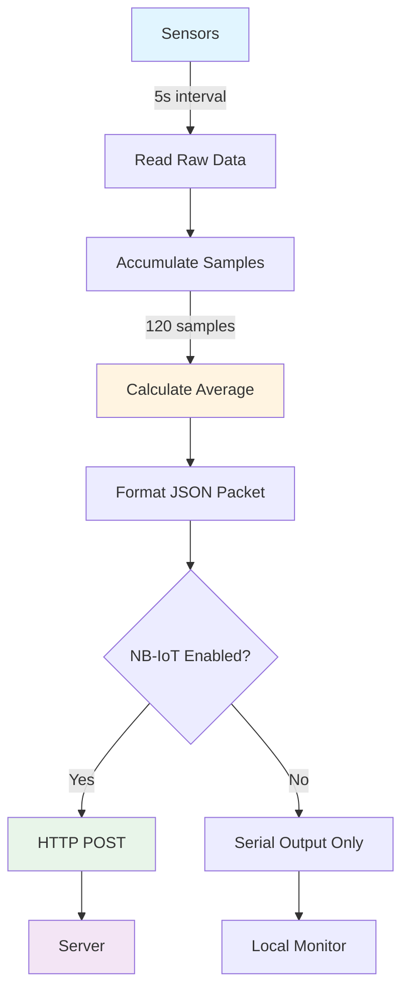

<!-- LICENSE INFORMATION
Copyright (C) 2025 ATARI Research Lab
Permission is granted to copy, distribute and/or modify this document
under the terms of the GNU Free Documentation License, Version 1.3
or any later version published by the Free Software Foundation;
with no Invariant Sections, no Front-Cover Texts, and no Back-Cover Texts.
A copy of the license is included in the section entitled "GNU
Free Documentation License".
-->

## Firmware Architecture

### Non-Blocking Timer System

The firmware uses a dual-timer architecture to achieve non-blocking operation:

1. **5-Second Timer** (`millis()`-based)
   - Triggers sensor reading and data accumulation
   - Based on Arduino's `millis()` function for microsecond precision
   - Non-blocking implementation prevents loop stalls

2. **10-Minute Timer** (RTC-based)
   - Triggers data averaging and transmission
   - Uses DS3231M RTC for accurate timekeeping independent of microcontroller clock
   - Maintains timing accuracy even during long-term deployment

### Modular Component Structure

The firmware is organized into logical modules, each with dedicated header and implementation files:

| Module | Files | Purpose |
|--------|-------|---------|
| **Main** | `firmware.ino` | Entry point, setup, and main loop |
| **Configuration** | `Configuracion.h` | Centralized settings (device ID, server, APN) |
| **Debug** | `Debug.h` | Multi-level logging macros |
| **Alarm System** | `Alarma.h/cpp` | Timer management and data averaging |
| **SEN54 API** | `SEN5X_API.h/cpp` | Particulate matter & VOC sensor interface |
| **T6793 API** | `T6793_API.h/cpp` | CO₂ sensor interface |
| **T67XX Driver** | `T67XX.h/cpp` | Low-level I2C driver for T6793 |
| **RTC** | `DS3231M.h/cpp` | Real-time clock interface |
| **NB-IoT** | `Transmision_NBIOT.h/cpp` | Network communication module |
| **DateTime** | `Datetime_helper.h` | Date/time utilities and timezone support |

### Data Flow Pipeline



### Memory Management

The firmware employs careful memory management strategies:

- **Static Allocation**: Most variables are statically allocated to avoid heap fragmentation
- **Accumulator Variables**: Separate sum variables for each sensor parameter
- **String Optimization**: Minimal dynamic string operations; uses `F()` macro for flash storage
- **Buffer Management**: Fixed-size buffers for serial communication and debug output

## Program Flow

### Setup Phase

<!-- markdownlint-disable MD046 -->
??? Flowchart

    ``` mermaid
        flowchart TD

        n1["Start"] --> rtc_init
        rtc_init["Initialize RTC and periodic alarms"] --> t6793_init["Initialize T6793 CO₂ sensor"]
        t6793_init --> sen5x_init["Initialize SEN54 PM/VOC sensor"]
        sen5x_init --> if_nbiot{"Enable NB-IoT?"}
        if_nbiot -- Yes --> nbiot_init["Initialize NB-IoT module SIM7020G"]
        if_nbiot -- No --> setup_done("Setup Complete")
        nbiot_init --> setup_done

        n1@{ shape: start}

        class n1,setup_done final;
        classDef default stroke-width:1px, stroke-dasharray:none, stroke:#374D7C, fill:#E2EBFF, color:#000000
        classDef final stroke-width:4px, stroke-dasharray: 0, stroke:#00C853, fill:#C8E6C9, color:#000000
    ```
<!-- markdownlint-enable MD046 -->

The `setup()` function executes once at power-on or reset:

1. **Serial Communication**: Initialize UART at 115200 baud (if debugging enabled)
2. **RTC Initialization**: Configure DS3231M and set initial alarm schedule
3. **Sensor Initialization**:
   - T6793-5K CO₂ sensor via I2C
   - SEN54 particulate matter/VOC sensor via I2C
4. **NB-IoT Initialization** (conditional): Initialize SIM7020G module if `HABILITAR_NBIOT = 1`

**Initialization Order**:

The specific order (RTC → T6793 → SEN54 → NB-IoT) ensures that timing is established before sensor
operation begins, and sensors are ready before network communication attempts.

### Main Loop Phase

<!-- markdownlint-disable MD046-->
??? Flowchart

    ``` mermaid
        flowchart TB

        setup_done["Setup"] --> check_alarm_5s["Check if 5 seconds have elapsed"]
        check_alarm_5s --> check_alarm_10min["Check if 10 minutes have elapsed"]
        check_alarm_10min --> if_alarm_5s{"5-second flag active?"}
        if_alarm_5s -- No --> if_alarm_10min{"10-minute flag active?"}
        if_alarm_5s -- Yes --> accumulate_data["Read sensors and accumulate data"]
        accumulate_data --> reset_alarm_5s["Reset 5-second flag"]
        reset_alarm_5s --> if_alarm_10min

        if_alarm_10min -- No --> check_alarm_5s
        if_alarm_10min -- Yes --> average_data["Calculate average of accumulated readings"]
        average_data --> if_nbiot2{"Enable NB-IoT?"}
        if_nbiot2 -- No --> reset_alarm_10min
        if_nbiot2 -- Yes --> transmit_data["Transmit averaged data via HTTP POST"]
        transmit_data --> reset_alarm_10min["Reset 10-minute flag and counters"]
        reset_alarm_10min --> check_alarm_5s

        setup_done:::final

        classDef default stroke-width:1px, stroke-dasharray:none, stroke:#374D7C, fill:#E2EBFF, color:#000000
        classDef final stroke-width:4px, stroke-dasharray: 0, stroke:#00C853, fill:#C8E6C9, color:#000000
    ```
<!-- markdownlint-enable MD046-->

The `loop()` function runs continuously with the following logic:

#### 5-Second Cycle (Data Acquisition)

```cpp
if (alarma_5s) {
    // Read all sensors
    sen5x_leer();   // PM1.0, PM2.5, PM4.0, PM10, VOC, temp, humidity
    t6793_leer();   // CO₂ concentration

    // Accumulate readings
    sum_sen5x_mc_2p5 += sen5x_mc_2p5;
    sum_t6793_co2 += t6793_co2;
    // ... (all parameters)

    // Increment sample counter
    cont1++;
    cont2++;

    alarma_5s = false;  // Reset flag
}
```

**Accumulation Strategy**:

- Separate counters (`cont1`, `cont2`) track samples for different sensor groups
- Allows for different sampling rates if sensors have varying reliability
- Accumulation happens in floating-point to preserve precision

#### 10-Minute Cycle (Averaging & Transmission)

```cpp
if (alarma_10min) {
    // Calculate averages
    avg_sen5x_mc_2p5 = sum_sen5x_mc_2p5 / cont1;
    avg_t6793_co2 = sum_t6793_co2 / cont2;
    // ... (all parameters)

    // Get current timestamp from RTC
    now = rtc.getRTCTime();
    fecha = formatDate(now);
    hora = formatTime(now);

    #if HABILITAR_NBIOT
        // Build JSON packet
        String json = nbiot_paquete();

        // Transmit via HTTP POST
        nbiot_enviar(json);
    #endif

    // Reset accumulators and counters
    sum_sen5x_mc_2p5 = 0.0f;
    cont1 = 0;
    // ...

    alarma_10min = false;  // Reset flag
}
```

**Averaging Algorithm**:

The firmware uses simple arithmetic mean: `average = sum / count`

This approach is memory-efficient and suitable for air quality data where extreme outliers are rare.

## Data Transmission

### JSON Packet Format

Data is transmitted as a JSON object via HTTP POST:

```json
{
  "device_id": "AIRLINK_01",
  "timestamp": "2025-10-16T14:30:00+02:00",
  "pm1_0": 8.5,
  "pm2_5": 12.3,
  "pm4_0": 15.7,
  "pm10": 18.4,
  "voc_index": 156,
  "nox_index": 0,
  "temperature": 23.5,
  "humidity": 45.2,
  "co2": 687
}
```

### Network Communication

The NB-IoT module (SIM7020G) uses AT commands over UART:

1. **Attach to Network**: `AT+CGATT=1`
2. **Configure APN**: `AT+CGDCONT=1,"IP","<APN>"`
3. **Activate PDP Context**: `AT+CGACT=1,1`
4. **HTTP POST**: `AT+HTTPDATA` → send JSON → `AT+HTTPACTION=1`
5. **Read Response**: `AT+HTTPREAD`

**Connection Handling**:

- Automatic retry on failure (configurable attempts)
- Connection state verification before transmission
- Power management between transmissions (optional)

## Sensor Interfaces

### SEN54 Particulate Matter & VOC Sensor

**Communication**: I2C (address 0x69)

**Library**: Sensirion I2C SEN5X (official)

**Measured Parameters**:

- PM1.0, PM2.5, PM4.0, PM10 (µg/m³)
- VOC Index (1-500 scale)
- Temperature (°C)
- Relative Humidity (%)

**Initialization Sequence**:

1. Soft reset
2. Start measurement mode
3. Wait for warm-up period (~30 seconds for accurate VOC)

### T6793-5K CO₂ Sensor

**Communication**: I2C (address 0x15)

**Range**: 0-5000 ppm CO₂

**Custom Driver**: `T67XX.h/cpp` implements low-level I2C protocol

**Measured Parameters**:

- CO₂ concentration (ppm)

**Calibration**:

The T6793 uses ABC (Automatic Baseline Correction) algorithm. No manual calibration required for typical indoor environments.

### DS3231M Real-Time Clock

**Communication**: I2C (address 0x68)

**Features**:

- Temperature-compensated crystal oscillator (TCXO)
- Battery backup (CR2032)
- Accuracy: ±5ppm (±2 minutes/year)

**Usage**:

- Timestamps for data packets
- Alarm scheduling for 10-minute intervals
- Survives power loss with backup battery

## Configuration System

All user-configurable parameters are centralized in `Configuracion.h`:

### Device Configuration

```cpp
#define ID_USUARIO "AIRLINK_01"        // Unique device identifier
```

### NB-IoT Configuration

```cpp
#define HABILITAR_NBIOT 1              // 1 = Enable, 0 = Disable
#define SERVIDOR_IP "http://example.com"
#define SERVIDOR_PUERTO "64340"
#define SERVIDOR_API "/aqindoor"
#define APN_NBIOT "iot.1nce.net"
```

### Debug Configuration

```cpp
#define DEBUG_LEVEL 3                  // 0-4 (see Debug.h)
#define DEBUG_ALARMA 2
#define DEBUG_SEN5X 2
#define DEBUG_T6793 2
#define DEBUG_NBIOT 2
```

See [Firmware Configuration](../user-guide/firmware-configuration.md) and [Debug Configuration](../user-guide/debug-configuration.md) for detailed documentation.

## Conditional Compilation

The firmware uses preprocessor directives for optional features:

```cpp
#if HABILITAR_NBIOT
    #include "Transmision_NBIOT.h"
    // ... NB-IoT code
#endif
```

**Benefits**:

- **Zero Overhead**: Disabled features consume no memory or CPU cycles
- **Clean Code**: No runtime conditionals for compile-time decisions
- **Flexible Builds**: Same codebase for different deployment scenarios

**Example Scenarios**:

- **Production with NB-IoT**: `HABILITAR_NBIOT = 1`, `DEBUG_LEVEL = 0`
- **Development/Testing**: `HABILITAR_NBIOT = 0`, `DEBUG_LEVEL = 3`
- **Local Data Logger**: `HABILITAR_NBIOT = 0`, `DEBUG_LEVEL = 1`

## Error Handling

The firmware implements defensive programming practices:

### Sensor Communication Errors

```cpp
if (!sen5x_leer()) {
    DEBUG_WARN("Error reading SEN5X sensor");
    // Continue operation without this sample
    // (counter not incremented, no bad data accumulated)
}
```

### RTC Initialization

```cpp
while (!rtc.begin()) {
    DEBUG_ERROR("RTC initialization error. Check connection...");
    delay(1000);  // Only blocking call (critical for operation)
}
```

### NB-IoT Transmission Failures

- Retry mechanism with configurable attempts
- Graceful degradation (local logging continues)
- Error codes logged for diagnostics

## Performance Characteristics

### Timing Accuracy

- **5-Second Timer**: ±10ms accuracy (millis()-based)
- **10-Minute Timer**: ±1 second accuracy (RTC-based)
- **Total Daily Drift**: <10 seconds over 24 hours

### Power Consumption

Typical power profile (5V input):

- **Idle (between samples)**: ~100-150 mA
- **Sensor Reading**: ~150-200 mA (brief spike)
- **NB-IoT Transmission**: ~200-300 mA (30-60 seconds)
- **Average**: ~120-180 mA depending on configuration

**Battery Life Estimate** (with 900mAh battery):

- Without NB-IoT: ~5-7 hours
- With NB-IoT (10min intervals): ~4-6 hours

!!! note "Power Optimization"
    For extended battery operation, consider:
    <!-- markdownlint-disable MD046 -->
    - Increasing transmission interval (e.g., 30 minutes)
    - Implementing sleep modes between samples
    - Using power-efficient NB-IoT module settings

## Building and Uploading

### Prerequisites

- Arduino CLI installed
- Board support package: `arduino:mbed_nano`
- Required libraries (see `nano33.yml`)

### Compilation

```powershell
# Using Arduino CLI with profile
arduino-cli compile --profile nano33ble --build-path firmware/build firmware/
```

### Upload

```powershell
# Upload to connected board
arduino-cli upload --profile nano33ble --input-dir firmware/build
```

### Serial Monitor

```powershell
# View debug output
arduino-cli monitor -p COM3 -c baudrate=115200
```

See the [project README](https://github.com/atari-researchlab/cicerone-airlink) for detailed build instructions.

## API Reference

Complete API documentation is available through Doxygen-generated references:

- [API Documentation](files.md) - Generated from `firmware/` source code

The API documentation includes:

- Function prototypes and parameters
- Variable definitions and usage
- Module dependencies
- Code examples
- Implementation notes

## Extending the Firmware

### Adding a New Sensor

1. **Create API Files**: `NEW_SENSOR_API.h` and `NEW_SENSOR_API.cpp`
2. **Define Interface**: `new_sensor_inicializar()` and `new_sensor_leer()`
3. **Declare Variables**: `extern float new_sensor_value` in header
4. **Add Accumulation**: Add `sum_new_sensor` and `avg_new_sensor` to `Alarma.h`
5. **Update Accumulation**: Call `new_sensor_leer()` in `acumular_datos()`
6. **Update Averaging**: Add averaging logic to `promediar_datos()`
7. **Update JSON**: Include new data in `nbiot_paquete()`
8. **Add Debug Support**: Define `DEBUG_NEW_SENSOR` level in `Debug.h`

### Modifying Timing Intervals

**5-Second Interval** (in `Alarma.cpp`):

```cpp
if (current_millis - prev_millis >= 5000) {  // Change 5000 to desired ms
    prev_millis = current_millis;
    alarma_5s = true;
}
```

**10-Minute Interval** (in `Alarma.cpp`):

Change the logic in `check_alarma_10min()` and `rtc_alarma_inicializar()` to calculate different minute intervals.

### Custom Data Formats

Modify `nbiot_paquete()` in `Transmision_NBIOT.cpp` to change JSON structure or add custom fields.

## Troubleshooting

### Common Issues

**Sensors Not Responding**:

- Check I2C connections (SDA, SCL, GND, VCC)
- Verify I2C addresses with scanner
- Enable verbose debug: `DEBUG_SEN5X = 4`

**NB-IoT Connection Failures**:

- Verify APN configuration
- Check SIM card activation and data plan
- Enable NB-IoT debug: `DEBUG_NBIOT = 4`
- Monitor AT command exchanges

**RTC Time Loss**:

- Replace CR2032 backup battery
- Re-sync time after battery replacement
- Check battery holder connections

**Memory Issues**:

- Reduce `DEBUG_LEVEL` to 0
- Disable unused modules
- Minimize string operations

## Known Limitations

- **No Local Storage**: Data not transmitted is lost (no SD card logging)
- **Single Threading**: Sequential sensor reading (no parallel I2C)
- **Fixed Sampling**: Intervals hardcoded in source (no runtime configuration)
- **No OTA Updates**: Firmware must be uploaded via USB

## Future Enhancements

Potential improvements for future versions:

- [ ] SD card logging for offline data storage
- [ ] Bluetooth Low Energy (BLE) configuration interface
- [ ] Deep sleep modes for extended battery life
- [ ] Adaptive sampling rates based on air quality changes
- [ ] MQTT protocol support as alternative to HTTP
- [ ] Over-the-air (OTA) firmware updates
- [ ] Multi-device mesh networking

## Related Documentation

- [Firmware Configuration Guide](../user-guide/firmware-configuration.md) - Configure device settings
- [Debug Configuration Guide](../user-guide/debug-configuration.md) - Debug system documentation
- [Hardware Description](../description/electronics.md) - PCB and electronic design
- [Assembly Guide](../user-guide/assembly.md) - Physical device assembly
- [Project Repository](https://github.com/atari-researchlab/cicerone-airlink) - Source code and issues

## License

The firmware is licensed under the **GNU General Public License v3.0 or later**.

See [LICENSE.md](https://github.com/atari-researchlab/cicerone-airlink/blob/main/firmware/LICENSE.md) for full license text.
