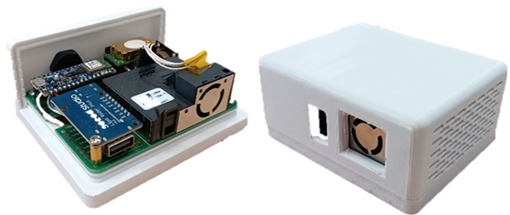

# CICERONE AirLink©

<!-- 

  Grant <strong><em>PID2021-126810OB-I00</em></strong> funded by: 
   

* * * -->

  
  
  

 

CICERONE AirLink© is an indoor air quality telemonitoring device designed for the project CICERONE (*PID2021-126810OB-I00*).

The air quality device operates by transmitting data every ten minutes for all the parameters collected by the various sensors, thanks to the communication module created in conjunction with the RTC. This way, if there are no data transmission failures, a total of 144 daily data points are obtained for each of the parameters collected by the CO2 and PM/VOCs sensors.

## :octicons-checklist-16: Features

- Sensors for measuring particulate matter (PM1, PM2.5, PM4, and PM10), volatile organic compounds (VOCs), carbon dioxide (CO2), temperature, and relative humidity.
- Clock for synchronizing sensor data readings and configuring the data packets to be transmitted.
- Autonomous data transmission independent of the user via an NB-IoT communication module. The device includes its own SIM card for sending average sensor values every ten minutes.
- Energy autonomy of up to 5 hours of operation on a fully charged battery.
- Optional cough detection feature using a machine learning algorithm. The device can count the number of cough events within a desired time frame.

## :material-file-link: Citations

--8<-- "./about/citations.md:10"